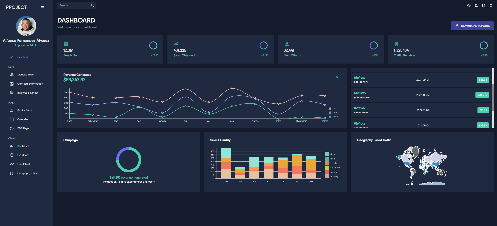

## Project Overview: my-first-react-app

My First React App is a learning project created to understand and explore the fundamentals of building web applications using React.js. This project serves as an educational endeavor, allowing developers to gain hands-on experience with React and related technologies.

### Application Preview

Below are some preview images of the administration menu implemented in the application:

**Dashboard:** Provides an overview of key metrics and performance indicators for the application.

**Team:** Displays information related to the project team, including member profiles and roles.

**Contacts:** Manages a list of contacts, enabling users to view, add, edit, and delete contact information.

**Invoices:** Tracks and manages invoices, allowing users to create, update, and manage billing information.

**Form:** Utilizes forms for data input and submission, often used for gathering user information.

**Calendar:** Integrates a calendar view to manage events, appointments, and scheduling within the application.

**FAQ:** Offers a comprehensive list of frequently asked questions and their corresponding answers for user reference.

**Bar:** Presents a bar chart visualization to display data in a graphical format, aiding in data analysis and comparison.

**Pie:** Utilizes a pie chart visualization to represent data composition and distribution in a circular format.

**Line:** Utilizes a line chart to showcase trends and patterns in data over a period of time, aiding in data analysis and visualization.

**Geography:** Integrates geographical data and maps to provide location-based information and insights within the application.

### Application Structure

The application's main component, `HomeComponent`, serves as the central hub for rendering the various sections of the administration menu. It employs routing and navigation to enable seamless transitions between different sections. The `Sidebar` provides easy access to different sections, while the `TopBar` offers additional navigation and control functionalities. The application utilizes MUI (Material-UI) components and theming for a visually appealing and user-friendly interface. The `ColorModeContext` and `ThemeProvider` ensure a consistent and customizable color scheme for the entire application.

### Getting Started with Create React App

This project was bootstrapped with [Create React App](https://github.com/facebook/create-react-app).

## Available Scripts

In the project directory, you can run:

### `npm start`

Runs the app in the development mode.\
Open [http://localhost:3000](http://localhost:3000) to view it in your browser.

The page will reload when you make changes.\
You may also see any lint errors in the console.

### `npm test`

Launches the test runner in the interactive watch mode.\
See the section about [running tests](https://facebook.github.io/create-react-app/docs/running-tests) for more information.

### `npm run build`

Builds the app for production to the `build` folder.\
It correctly bundles React in production mode and optimizes the build for the best performance.

The build is minified and the filenames include the hashes.\
Your app is ready to be deployed!

See the section about [deployment](https://facebook.github.io/create-react-app/docs/deployment) for more information.

### `npm run eject`

**Note: this is a one-way operation. Once you `eject`, you can't go back!**

If you aren't satisfied with the build tool and configuration choices, you can `eject` at any time. This command will remove the single build dependency from your project.

Instead, it will copy all the configuration files and the transitive dependencies (webpack, Babel, ESLint, etc) right into your project so you have full control over them. All of the commands except `eject` will still work, but they will point to the copied scripts so you can tweak them. At this point you're on your own.

You don't have to ever use `eject`. The curated feature set is suitable for small and middle deployments, and you shouldn't feel obligated to use this feature. However we understand that this tool wouldn't be useful if you couldn't customize it when you are ready for it.

## Learn More

You can learn more in the [Create React App documentation](https://facebook.github.io/create-react-app/docs/getting-started).

To learn React, check out the [React documentation](https://reactjs.org/).

### Code Splitting

This section has moved here: [https://facebook.github.io/create-react-app/docs/code-splitting](https://facebook.github.io/create-react-app/docs/code-splitting)

### Analyzing the Bundle Size

This section has moved here: [https://facebook.github.io/create-react-app/docs/analyzing-the-bundle-size](https://facebook.github.io/create-react-app/docs/analyzing-the-bundle-size)

### Making a Progressive Web App

This section has moved here: [https://facebook.github.io/create-react-app/docs/making-a-progressive-web-app](https://facebook.github.io/create-react-app/docs/making-a-progressive-web-app)

### Advanced Configuration

This section has moved here: [https://facebook.github.io/create-react-app/docs/advanced-configuration](https://facebook.github.io/create-react-app/docs/advanced-configuration)

### Deployment

This section has moved here: [https://facebook.github.io/create-react-app/docs/deployment](https://facebook.github.io/create-react-app/docs/deployment)

### `npm run build` fails to minify

This section has moved here: [https://facebook.github.io/create-react-app/docs/troubleshooting#npm-run-build-fails-to-minify](https://facebook.github.io/create-react-app/docs/troubleshooting#npm-run-build-fails-to-minify)
